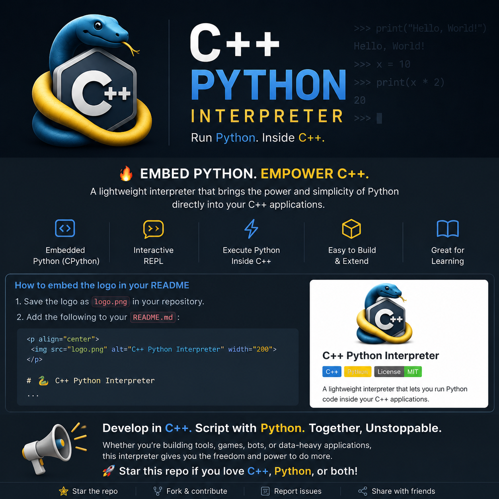

<p align="center">
  
</p>

Here’s a clean, professional `README.md` you can drop straight into your repo:

---

# 🐍 C++ Python Interpreter

A lightweight project that demonstrates how to embed and/or simulate a Python interpreter using C++. It explores how programming languages can be integrated or built from scratch, combining C++ performance with Python-like flexibility.

---

## 🚀 Features

* 🔗 Embedded CPython interpreter inside a C++ program
* 💬 Interactive REPL (Read–Eval–Print Loop)
* ⚡ Execute Python code directly from C++
* 🧪 Optional toy interpreter (learning version)
* 🧠 Supports variables and arithmetic (basic implementation)

---

## 📁 Project Structure

```
.
├── main.cpp       # Core interpreter implementation
├── Makefile       # Build system
└── README.md      # Project documentation
```

---

## ⚙️ Requirements

Make sure you have:

* C++ compiler (g++ / clang++)
* Python 3 development libraries

### Install Python dev headers (Linux):

```bash
sudo apt install python3-dev
```

---

## 🔧 Build

Using Makefile:

```bash
make
```

---

## ▶️ Run

```bash
make run
```

Or manually:

```bash
./py_embed
```

---

## 💡 Example Usage

```text
py> print("Hello from embedded Python!")
py> x = 10
py> print(x * 2)
```

---

## 🧠 How It Works

This project demonstrates two possible approaches:

### 1. Embedded Python (CPython API)

Uses Python’s official C API (`Python.h`) to run real Python code inside a C++ application.

### 2. Toy Interpreter (Optional)

A simplified interpreter that:

* Parses input strings
* Evaluates arithmetic expressions
* Stores variables in memory

---

## 📚 Learning Goals

This project is designed to help you understand:

* How interpreters execute code
* How Python can be embedded into other languages
* Basics of parsing and evaluation
* Interaction between C++ and scripting languages

---

## 🛠 Build Commands

```bash
make        # Build project
make run    # Run interpreter
make clean  # Remove binaries
```

---

## 📜 License

MIT License — feel free to use and modify.

---

## 🚀 Future Improvements

* Full AST-based interpreter
* Support for functions and loops
* Bytecode VM implementation
* Python-like syntax parser
* Cross-platform Windows support

---

If you want, I can also:

* add GitHub badges (stars, license, build status)
* make it look like a viral repo README
* or turn this into a full “mini Python project series” structure
